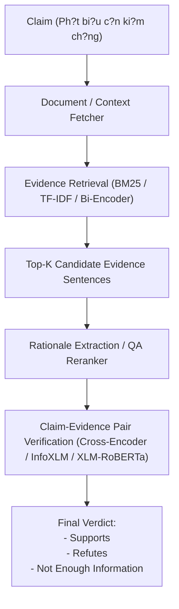

# Fact-Checking Pipeline Architecture

This project implements a multi-stage Vietnamese Fact-Checking pipeline modeled after standard FEVER / ViWikiFC architectures.

## Pipeline Flow

## Module Components

1. **Evidence Retrieval (`src/retrieval/`)**:
   - `bm25_retriever.py`: Lexical matching using BM25 ranking across candidate sentences.
   - Dense retrieval (future work: PhoBERT bi-encoder / SimCSE embeddings).

2. **Verdict Classifier (`src/models/`)**:
   - `classifier.py`: Cross-encoder that takes `[CLS] Claim [SEP] Evidence [SEP]` and predicts logits over 3 classes.
   - Supported backbones: `xlm-roberta-base`, `xlm-roberta-large`, `microsoft/infoxlm-large`, `vinai/phobert-base-v2`.

3. **Evaluation (`src/utils/metrics.py`)**:
   - Macro Accuracy, Precision, Recall, Macro F1-score.
