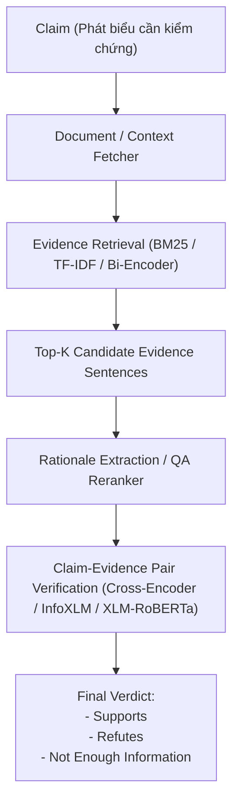

# Kiến Trúc Hệ Thống Fact-Checking Tiếng Việt

Dự án này cài đặt pipeline kiểm chứng thông tin tiếng Việt dựa trên kiến trúc chuẩn của các mô hình FEVER / ViWikiFC.

## Sơ Đồ Pipeline

## Các Thành Phần Chính

1. **Truy Xuất Bằng Chứng (`src/retrieval/`)**:
   - `bm25_retriever.py`: Thuật toán đối sánh từ vựng BM25 xếp hạng các câu ứng viên trong ngữ cảnh.
   - Dense retrieval: Mở rộng với PhoBERT bi-encoder hoặc embedding ngữ nghĩa.

2. **Phân Loại Xác Thực (`src/models/`)**:
   - `classifier.py`: Cross-encoder nhận đầu vào `[CLS] Claim [SEP] Evidence [SEP]` và phân loại 3 nhãn.
   - Các kiến trúc hỗ trợ: `xlm-roberta-base`, `microsoft/infoxlm-large`, `vinai/phobert-base-v2`.

3. **Đánh Giá (`src/utils/metrics.py`)**:
   - Tính toán Accuracy, Macro Precision, Macro Recall và Macro F1-score.